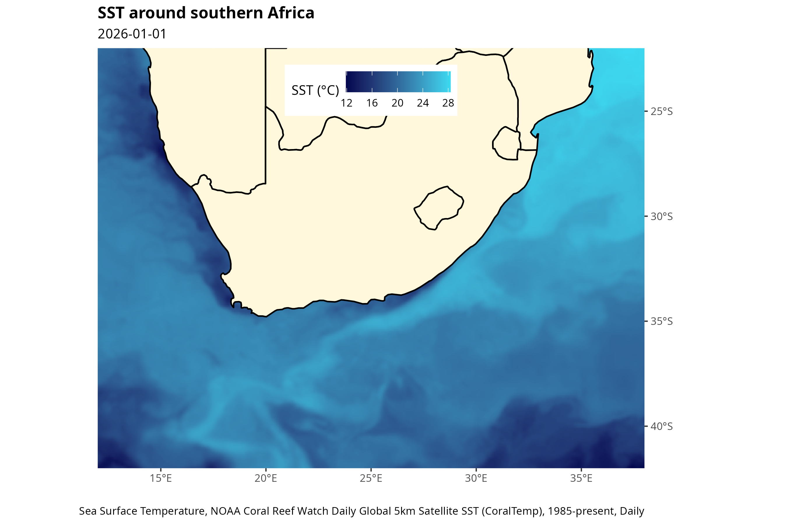

# SST Visualiser Web App

This repository houses the framework for an R-based Shiny web app that downloads remote-sensed sea surface temperature (SST) data and display it using ggplot2.

This will be published to either Posit Connect Cloud or Github Pages, with the goal that the user may select a spatial and temporal extent, and SST will be plotted. 

The "end-goal" output would be something like:

That started with a choice of SST data product, time frame and co-ordinate bounds.